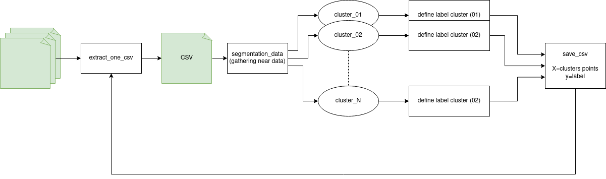

# ros_detection_legs 

- [ros_detection_legs](#ros_detection_legs)
  - [Use](#use)
    - [Deep-learning](#deep-learning)
      - [prepocessing data](#prepocessing-data)
      - [train model](#train-model)
    - [ROS](#ros)
  - [Architecture](#architecture)
    - [Extract data](#extract-data)
    - [Preprocessing data](#preprocessing-data)
      - [original data](#original-data)
      - [segmentation](#segmentation)
    - [Prediction](#prediction)

## Use

### Deep-learning

:warning: a model is already training, saved in **./model/** folder 

#### prepocessing data

run prepocessing script: 
```
$ python3 src/preprocessing.py
```
once run data are stored in **./data/data/train/**

#### train model

run training script: 
```
$ python3 src/training.py 
```

### ROS

1. compile package
```
# inside your ros workingspace
$ catkin build ros_detection_legs
```

2. run [detector_node](./nodes/detecor_node.py) 
```
# source devel before
$ rosrun ros_detection_legs detector_node.py
```

## Architecture

### Extract data
- package: **ros_lidar_recorder** https://github.com/PouceHeure/ros_lidar_recorder
- dataset: https://github.com/PouceHeure/dataset_lidar2D_legs


### Preprocessing data



#### original data 


#### segmentation


### Prediction


