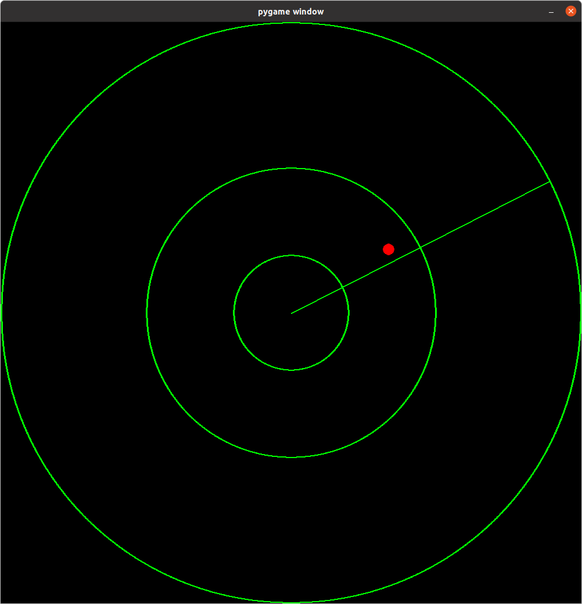

# ros_detection_legs 

- [ros_detection_legs](#ros_detection_legs)
  - [Goal](#goal)
  - [Use](#use)
    - [Deep-learning](#deep-learning)
      - [prepocessing data](#prepocessing-data)
      - [train model](#train-model)
    - [ROS](#ros)
  - [Architecture](#architecture)
    - [Extract data](#extract-data)
    - [Preprocessing data](#preprocessing-data)
      - [segmentation](#segmentation)
    - [Training](#training)
    - [Prediction](#prediction)


## Goal 
Extract legs position from lidar data, like this: 



## Use

### Deep-learning

:warning: a model is already training, saved in **./model/** folder 
:pencil: if you want to change some parameters, please update [./src/ros_detection_legs/deep_learning/config/parameters.json](./src/ros_detection_legs/deep_learning/config/parameters.json)
#### prepocessing data

run prepocessing script: 
```
$ python3 src/preprocessing.py
```
once run data are stored in **./data/train/**

#### train model

run training script: 
```
$ python3 src/training.py 
```

### ROS

1. compile package
```
# inside your ros workingspace
$ catkin build ros_detection_legs
```

2. run [detector_node](./nodes/detecor_node.py) 
```
# source devel before
$ rosrun ros_detection_legs detector_node.py
```

3. use [ros_pygame_radar2D](https://github.com/PouceHeure/ros_pygame_radar_2D)
```
# clone project to workspace
$ git clone https://github.com/PouceHeure/ros_pygame_radar_2D

# compile package 
$ catkin build ros_pygame_radar_2D

# run radar_node.py 
$ rosrun ros_pygame_radar_2D radar_node.py
```

## Architecture

### Extract data
- package: **ros_lidar_recorder** https://github.com/PouceHeure/ros_lidar_recorder
- data labeling tool: **lidar_tool_label** https://github.com/PouceHeure/lidar_tool_label
- dataset: https://github.com/PouceHeure/dataset_lidar2D_legs


### Preprocessing data

This schema defined princpals steps: 


We can create clusters with a segmentation, by this way data will gathering if there are closed. 

#### segmentation

Before segmentation, we have to found how to compute a distance between 2 polar points. 

First approach, convert all polar points to cartesien and apply a classic norm. 

Second approach, convert 2 points from polar coordinates to cartesien coordinates and find an expression of distance with theta and r. 


A second distance is computed: 


Once we have define compute expression, we have to define hyper-parameters:  

- **limit_distance** 
- **limit_radius**


### Training 

model used: RNN with LSTM cells. 

more information about LSTM: https://www.tensorflow.org/api_docs/python/tf/keras/layers/LSTM

### Prediction

A ros node, **detector_node** subscribes to **/scan** topic. Once data are pusblished to this topic, the node uses the training model to predict legs position. Legs positions are published to **/radar** topic. 


Like the training, data need to be tranformed. So before prediction clusters are created, directly in the subscriber callback function. 

